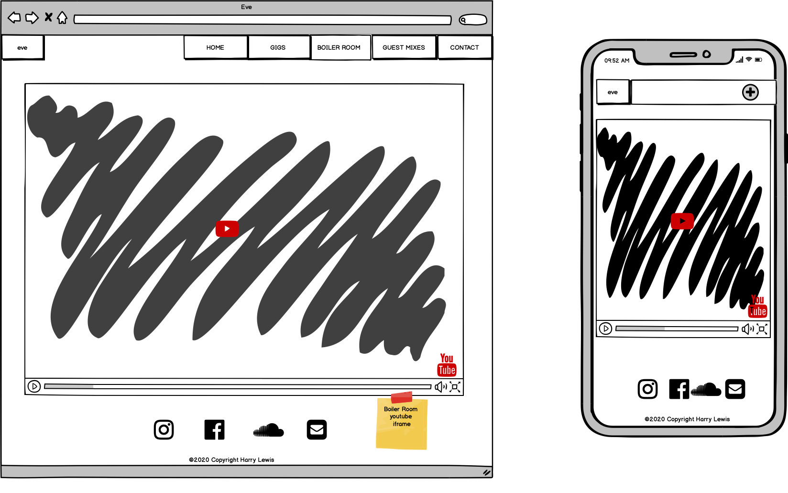
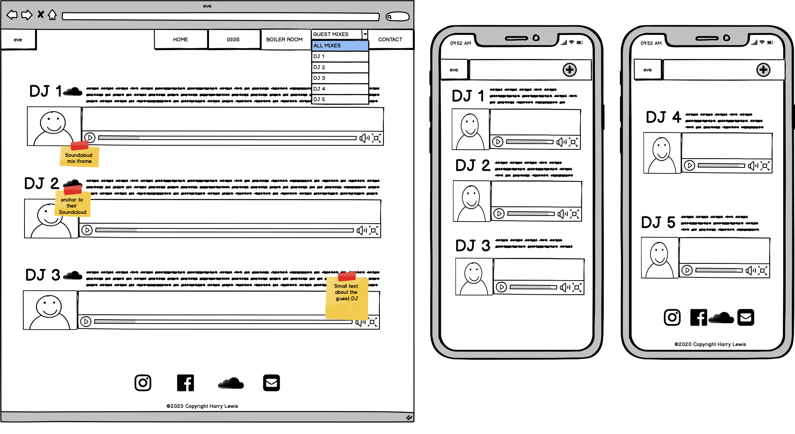
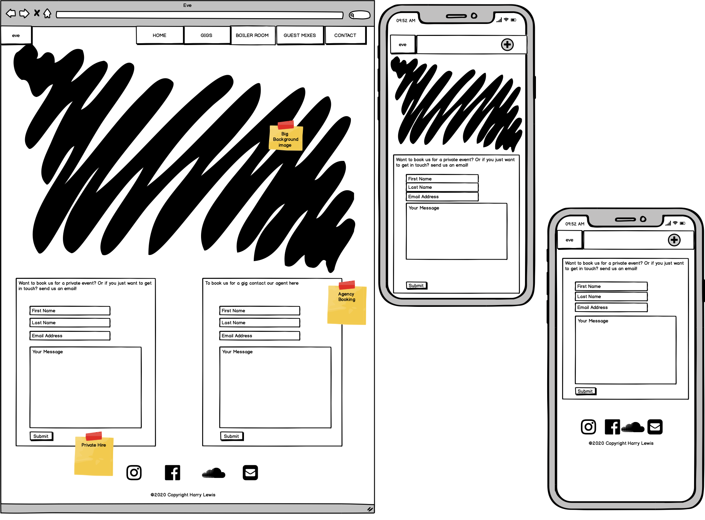

# **User Centric Frontend Development Milestone Project - Harry Lewis**
# eve DJ Website

For this milestone project I decided to make a website spcecifically designed for the DJ group **eve**. By combining all the learning and study from the previous three modules I have designed a fully responsive front-end website using HTML5, CSS3, Boostootstrap and other CSS libraries/frameworks that will be credited further into this README.

**eve** are a collective of three fermale DJ's residing in Dublin. They have a good online presence in the form of social media but have not got their own personal website. The benefits of this website for the client will be to increase their fan abse, gain them future bookings and give their users are expierience that will keep them coming back to the site.

# UX
The client wants a website where they can showcase their music/media from previous gigs to boost their fanbase and also have a site for returning fans to keep up to date with whats going on. They also want to have a section where they can be booked by promoters for future gigs.

In summary the main focus of the website will be to:
 * Desing a website that will lead to bookings & increase fan base
 * Boost online presence
 * Present a UX that will encourage users to return to the website
 * Have easy access to all other platforms of media / online content for promotion of the artist

## **User Stories**
* As a fan, I want to see eve's upcoming gigs
* As a DJ I want to showcase our music
* As a promoter, I want to book this DJ
* As a fan, I want to book this artist for a private event
* As a fan, I want to listen to eve's previous mixes

## **Wireframes** ([drive link](https://drive.google.com/open?id=14eP_CmihxwgpibQSHMYj0-kUEvzBFqXD))

**Index Page**

**Gigs Page**

**Boiler Room Page**

**Guest Mixes Page**

**Contact Page**

# Features
 * Nav bar that has clear consice direction to lead the user to relevant media, music and contact
 * Call out sectioin for bookings just below the hero video thats stands out to entice promoters and potential bookers
 * An "about me section" on the index page to give first time viewiers an insight into who the client is
 * Provide links to social media in the footer accross all pages for easy access to all social accounts

Future features:

# Technologies Used 
# Testing
# Deployment
# Credits