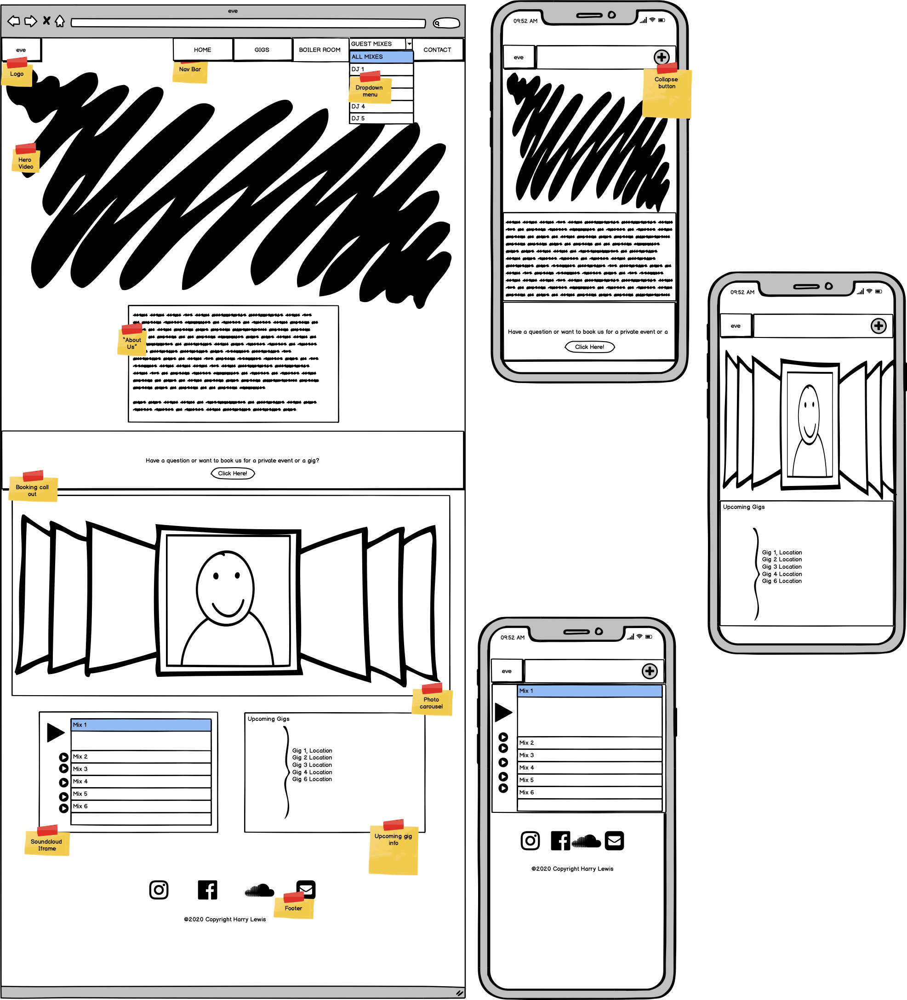

# **User Centric Frontend Development Milestone Project - Harry Lewis**

# eve DJ Website

For this milestone project I decided to make a website spcecifically designed for the DJ group **eve**. By combining all the learning and study from the previous three modules I have designed a fully responsive front-end website using HTML5, CSS3, Boostootstrap and other CSS libraries/frameworks that will be credited further into this README.

**eve** are a collective of three fermale DJ's residing in Dublin. They have a good online presence in the form of social media but have not got their own personal website. The benefits of this website for the client will be to increase their fan abse, gain them future bookings and give their users are expierience that will keep them coming back to the site.

# UX

The client wants a website where they can showcase their music/media from previous gigs to boost their fanbase and also have a site for returning fans to keep up to date with whats going on. They also want to have a section where they can be booked by promoters for future gigs.

In summary the main focus of the website will be to:

- Desing a website that will lead to bookings & increase fan base
- Boost online presence
- Present a UX that will encourage users to return to the website
- Have easy access to all other platforms of media / online content for promotion of the artist

## **User Stories**

- As a fan, I want to see eve's upcoming gigs
- As a DJ I want to showcase our music
- As a promoter, I want to book this DJ
- As a fan, I want to book this artist for a private event
- As a fan, I want to listen to eve's previous mixes

## **Wireframes & Features**

### **Index Page**

#### **Feature 1 - Nav bar**

The navigation bar will be at the top of every page and will consist of 6 components:

1. Home Tab. Pretty simple, brings the user back to the home page.

1.  Eve Logo. In the left corner will be the logo of the DJ and can be clicked on any page to bring you back to the home / index page.

1.  Gigs Tab. This will be the button on the navigation bar that brings you to view infiormation about upcomming and past gigs.

1.  Boiler Room Tab. This will bring you to the video of eve's Boiler room.

1.  Guest Mixes Tab. This dropdown button will show all the DJ's who have been fetaured as a guest DJ. Clicking on a DJ will bring you directly to the part in the gigs page the DJ is and be able to listen to their mix.

1.  Contact Tab. This buttong will bring you to the page where the users can either book with the DJ's agent or send them a message directly.

When viewed on mobile devices the nav bar colabses into a single button that when clicked will expand and show the tabs insdide to maintain screen real estate.

#### **Feature 2 - Hero video**

The hero video is showcasing moving artwork that has been done by the DJ's artwork team. This will be set to loop and autoplay so the user will imediately see the artwork in motion.

#### **Ferature 3 - About me section**

The about us section will give new/first time users a brief but detailed introduction as to who the the artists is and their background. There is a hidden feature here where you hover over the DJ's names it will highlight in pink. Clicking on this will bring you to the DJ'S solo DJ account. This was requested by the client.

#### **Feature 4 - Booking Call out**

This section will allow users who are interested having a private even to send the eve DJ's a direct message. By clicking the "book us here" buttong a For will pop up on screen for them to fill out. The forms also have validation on all entries so they cannot enter incorrect or no information.

#### **Feature 5 - Image Carosuel**

Photo's of the eve DJ's will be on show here to give the users a feel as to who the artists are. Using teh bootstrap Carosuel the images automaticly change.

#### **Feature 6 - upcoming gigs**

This Feature will show users the next four gigs that the eve DJ's have been booked for. This will also be developed further as a future feature.

#### **Soundcloud iframe**

The Soundcloud iframe will give users the ability to listento the mixes that they have uploaded to the eve Soundcloud from the eve website.

#### **footer**

The footer which is accross all pages of the website has links to all of eve's social media accounts, Facebook, Soundcloud, Instagram and a final link with a letter icon that take the user to the contact page of the website.

### **Gigs Page**

####  **Feature 1 - Next Gig section**

This section is split into three parts. This will also be developed further as a future feature.

1. **Next Gig Poster** The poster / video of next gig will be displayed that is from the night promoter.

1. **Event Info** All information about the next gig from the event page (facebook) will be displayed here for. This will also have a button below the information to take the user to the event page on facebook. 

1. **Coming Up** As featured in the Index page. This section will show user the next 3 gigs eve have been booked for.

#### **Feature 2 - Previous Gigs**
In this section the will be a photo collage of all the past gigs eve have played. This will also be developed further as a future feature.

### **Boiler Room Page**
A youtube iframe will be used so that users can watch the eve Boiler Room without having to leave the website.

### **Guest Mixes Page**
#### **Feature 1- Soundcloud iframe**
the Soundcloud iframe will be used here so users can listen to the artists guest mix they have recorded for eve.

#### **Feature 2 - Info about the artist**
Next to the Soundcloud iframe there will be a short description about teh artist that eve have provided. Next to their Name will be a clickable icon for users if they wish to visit the music page of the artist. 

### **Contact Page**
There will be two forms here on the contact page for users to use. One is for a booking to me made with eve's agent, and the other is to send them a message directly. 

All entries have validation on so that the user will have to have all relevent information filled in before they can submit their message.

Future features:

# Technologies Used
- HTML5 
- CCS
- Bootstrap - CSS, Javascript & JQuery styling 
- https://favicon.io/ - To create the favicon
- Font Awesome - for use of icons throght the website
- Google Fonts

# Testing

# Deployment

# Credits
